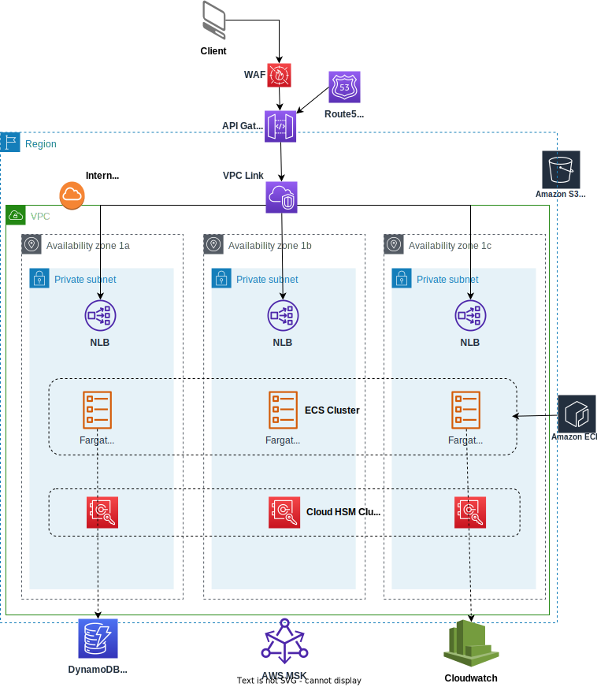

# Overview Personal Data Vault

## Summary

**PagoPa Spa** has to manage user data, potentially from all Italian citizens who interact with digital services in Public Administrations.
Often this data is highly confidential and has to be compliant with regulations.

Personal Data Vault is a service provided by **PagaPa** aiming to manage in a compliant manner Person Identifiable Information and tokenize it with pseudo random code.

We classify this service **tier zero** with the meaning that other services rely on it and it provides a set of Rest Api to interact with it.
Cloud Infrastructure

The application consists of just a couple of micro services - java spring boot applications - and it’s hosted in AWS with the goal to be:
Highly available
Scale fast to support high number of requests with burst estimated till 1250 req / sec
Secure due to the fact it’s managing confidential information.

The main resources hosting the solution in the diagram below are:
* Api Gateway with regional endpoint, WAF and no caching by requirements.
* Network Load Balancer (NLB) deployed in 3 private subnets
* VPC Link to allow the communication between the Api Gateway and the NLB
* ECS Fargate Cluster with tasks running in 2 / 3 private subnets and autoscaling based on CPU metrics
* DynamoDB table with autoscaling
* ~~Cloud HSM to provide a customer managed key to encrypt / decrypt data in DynamoDB~~

Note: Rest Api(s) which are publicly available require the standard Api Gateway x-api-key http header to authenticate and each key is associated to a dedicated plan with Rate Limits per method.


[]()


## Infrastructure

This repository hosts the terraform code useful to create the infrastructure shown in the picture above.

The code base has been designed to manage different environments: dev,uat,prod.

So fare we manage uat and prod environment and you can find the configurations in:
* src/init/env
* src/main/env

## Requirements

You need the following tools to work on your laptop 

1. [aws cli](https://docs.aws.amazon.com/cli/latest/userguide/getting-started-install.html) installed.
2. [tfenv](https://github.com/tfutils/tfenv) to mange terraform versions.

## Start building

Create:

* The s3 bucket to store terraform state
* The Dynamodb table to manage terraform locks
* The Github OpenId connection

```bash
# init uat environment
cd src/init

./terraform.sh init uat

./terraform.sh apply uat

# create uat environment

cd ../../
cd src/main

./terraform.sh init uat

./terraform.sh apply uat
```

## Github actions

In the repository two github actions are already provided:

* **terraform-plan**: it runs every time a new Pull request(PR) is created and every time a push is made within the PR branch. It runs terraform plan through all the environments.

* **terraform-apply**: it runs terraform apply in one of the environment (uat by default) every time a PR is merged into main branch or it can be triggered manually and users have the facolty to choose on which environment to apply it.

### Configurations

* Create [github environment](https://docs.github.com/en/actions/deployment/targeting-different-environments/using-environments-for-deployment) for uat and prod.

* In each environmen create a secret named **IAM_ROLE** and set as a value the **arn** of the role created at the very beginnig when you set up the environment. 